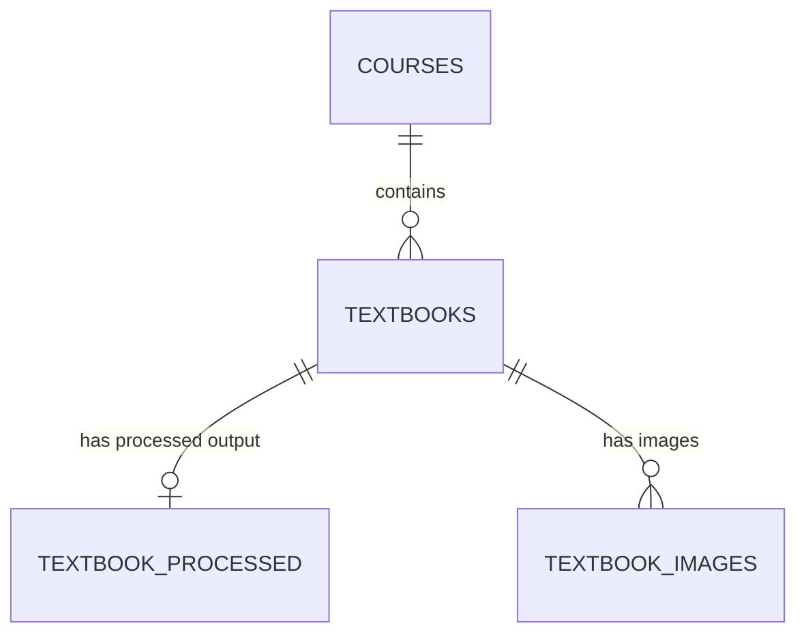

# Database & Vector Store Documentation

## Overview

This project uses two storage systems:

1. **PostgreSQL (via Supabase)** — Relational database for application data (textbooks, courses)
2. **Qdrant Cloud** — Vector database for semantic search over textbook chunks

---

## PostgreSQL Tables

### `courses`

Groups textbooks by course/subject.

| Column | Type | Constraints | Description |
|--------|------|-------------|-------------|
| `course_id` | UUID | PK, auto-generated | Unique course identifier |
| `course_name` | VARCHAR(255) | NOT NULL | Course title |
| `description` | TEXT | nullable | Course description |
| `status` | VARCHAR(20) | DEFAULT `'active'` | `active` or `archived` |
| `created_at` | TIMESTAMPTZ | DEFAULT now() | Creation timestamp |

**Relationships:** Contains many textbooks.

---

### `textbooks`

Core entity — represents an uploaded PDF textbook.

| Column | Type | Constraints | Description |
|--------|------|-------------|-------------|
| `textbook_id` | UUID | PK, auto-generated | Unique textbook identifier |
| `course_id` | UUID | FK → `courses.course_id`, NOT NULL | Parent course |
| `title` | VARCHAR(255) | NOT NULL | Textbook title |
| `description` | TEXT | nullable | Textbook description |
| `file_url` | VARCHAR(500) | NOT NULL | Supabase Storage URL for the original PDF |
| `file_type` | VARCHAR(50) | NOT NULL | File extension without dot (e.g. `pdf`) |
| `uploaded_at` | TIMESTAMPTZ | DEFAULT now() | Upload timestamp |
| `processing_status` | VARCHAR(20) | DEFAULT `'not_started'` | `not_started` / `queued` / `processing` / `completed` / `failed` |
| `visibility_status` | VARCHAR(20) | DEFAULT `'private'` | `private` / `live` (searchable after processing) |

**Relationships:** Belongs to a course. Has processed data and images.

---

### `textbook_processed`

Stores references to the converted output files (markdown + Docling JSON) after RAG pipeline processing.

| Column | Type | Constraints | Description |
|--------|------|-------------|-------------|
| `textbook_id` | UUID | PK, FK → `textbooks.textbook_id` | 1:1 with textbook |
| `markdown_url` | VARCHAR(500) | NOT NULL | Public URL for the markdown file |
| `markdown_storage_path` | VARCHAR(500) | NOT NULL | Storage path (`processed/{id}/content.md`) |
| `docling_json_url` | VARCHAR(500) | nullable | Public URL for Docling JSON |
| `docling_json_storage_path` | VARCHAR(500) | nullable | Storage path (`processed/{id}/docling.json`) |
| `processed_at` | TIMESTAMPTZ | DEFAULT now() | When processing completed |

---

### `textbook_images`

Stores metadata for images extracted from textbook PDFs.

| Column | Type | Constraints | Description |
|--------|------|-------------|-------------|
| `id` | INTEGER | PK, auto-increment | Row ID |
| `textbook_id` | UUID | FK → `textbooks.textbook_id`, NOT NULL | Parent textbook |
| `image_index` | INTEGER | NOT NULL | Order of image in document |
| `image_name` | VARCHAR(255) | NOT NULL | Filename (e.g. `textbook_{id}_img0.png`) |
| `image_url` | VARCHAR(500) | NOT NULL | Public URL from Supabase Storage |
| `storage_path` | VARCHAR(500) | NOT NULL | Storage path (`images/{id}/{name}`) |
| `mime_type` | VARCHAR(50) | DEFAULT `'image/png'` | Always PNG |
| `width` | INTEGER | nullable | Image width in pixels |
| `height` | INTEGER | nullable | Image height in pixels |
| `file_size` | INTEGER | nullable | File size in bytes |
| `picture_category` | VARCHAR(100) | nullable | Docling classification label |
| `smiles` | VARCHAR(500) | nullable | SMILES notation (for chemistry structures) |
| `created_at` | TIMESTAMPTZ | DEFAULT now() | Extraction timestamp |

---

## Entity Relationship Diagram



---

## Qdrant Vector Store

### Collection: `textbook_chunks`

| Setting | Value |
|---------|-------|
| Collection name | `textbook_chunks` |
| Vector size | 384 dimensions (configurable via `EMBEDDING_DIMENSION` env var) |
| Distance metric | Cosine similarity |
| Embedding model | `BAAI/bge-small-en-v1.5` (configurable via `EMBEDDING_MODEL` env var) |

> **Note:** The HybridChunker tokenizer is hardcoded to `BAAI/bge-base-en-v1.5` in `pipeline_stages.py`. If you change the embedding model, update the tokenizer to match.

### How Data Gets Into Qdrant

The RAG pipeline (Celery worker) processes each textbook through 7 stages:

1. **Ingestion** — Download PDF from Supabase Storage
2. **Conversion** — Parse PDF with Docling (extracts structure, formulas, tables, images)
3. **Export** — Save markdown + Docling JSON to Supabase Storage
4. **Images** — Extract images and upload to Supabase Storage
5. **Chunking** — Split document using `HybridChunker` (512 tokens max, tokenizer: `BAAI/bge-base-en-v1.5`). Falls back to heading-based markdown splitting (1500 char max) if HybridChunker fails
6. **Embedding** — Encode each chunk with BGE (`BAAI/bge-small-en-v1.5` by default), prefix: `"Represent this sentence: {text}"`, normalized to unit vectors, batched in groups of 64
7. **Indexing** — Upsert vectors to Qdrant in batches of 100

### Point Structure (each vector in Qdrant)

| Field | Type | Description |
|-------|------|-------------|
| `id` | UUID (deterministic) | Generated as `uuid5(NAMESPACE_DNS, "{textbook_id}_chunk{chunk_index}")` — same textbook always overwrites same points |
| `vector` | float[384] | Normalized BGE embedding (dimension configurable) |

### Payload (metadata stored alongside each vector)

| Field | Type | Example | Description |
|-------|------|---------|-------------|
| `textbook_id` | string | `"a1b2c3..."` | Links back to the PostgreSQL `textbooks` table |
| `text` | string | `"Chemical bonding occurs when..."` | The actual chunk text (returned in search results) |
| `headings` | string[] | `["Chapter 3", "3.1 Ionic Bonds"]` | Document heading hierarchy for this chunk |
| `page_numbers` | int[] | `[42, 43]` | PDF page numbers this chunk spans |
| `content_type` | string | `"text"` | `text` / `table` / `formula` / `picture` / `mixed` |
| `has_formula` | bool | `false` | Whether chunk contains math formulas |
| `has_table` | bool | `false` | Whether chunk contains tables |
| `has_figure` | bool | `true` | Whether chunk contains figures/pictures |
| `image_urls` | string[] | `["https://...img0.png"]` | Supabase Storage URLs for images in this chunk (empty if no figures) |
| `source_pdf` | string | `"Organic Chemistry"` | Textbook title |
| `chunk_index` | int | `17` | Sequential chunk number within the textbook |

### Search (Query Time)

When a user searches:

1. The query is prefixed: `"Represent this sentence for searching relevant passages: {query}"`
2. Encoded with the same BGE model → 384-dim vector (by default)
3. Qdrant performs cosine similarity search
4. Optional filter: `textbook_id` field to scope search to one textbook
5. Returns top-K results with score, text, and metadata

---

## Storage Paths (Supabase Storage)

All files are stored in the `textbooks` bucket:

| Path Pattern | Content |
|--------------|---------|
| `{course_id}/{uuid}.{ext}` | Original uploaded PDF (uuid is auto-generated) |
| `processed/{textbook_id}/content.md` | Converted markdown |
| `processed/{textbook_id}/docling.json` | Full Docling extraction JSON |
| `images/{textbook_id}/textbook_{textbook_id}_img{N}.png` | Extracted images |

---

## Data Flow Summary

```
Textbook PDF uploaded
        │
        ▼
┌─────────────────┐
│  PostgreSQL     │  textbooks row created
└────────┬────────┘
         │  Processing triggered
         ▼
┌─────────────────┐
│  Celery Worker  │  (status: queued → running)
│  (RAG Pipeline) │
└────────┬────────┘
         │
         ├──► Supabase Storage: markdown, JSON, images
         │
         ├──► PostgreSQL: textbook_processed, textbook_images rows
         │
         └──► Qdrant: chunked vectors with metadata
                      (textbook_chunks collection)
         │
         ▼
┌─────────────────┐
│  textbooks row  │  processing_status: completed, visibility: live
└─────────────────┘
         │
         ▼
   Students can now search via Qdrant semantic search
```
